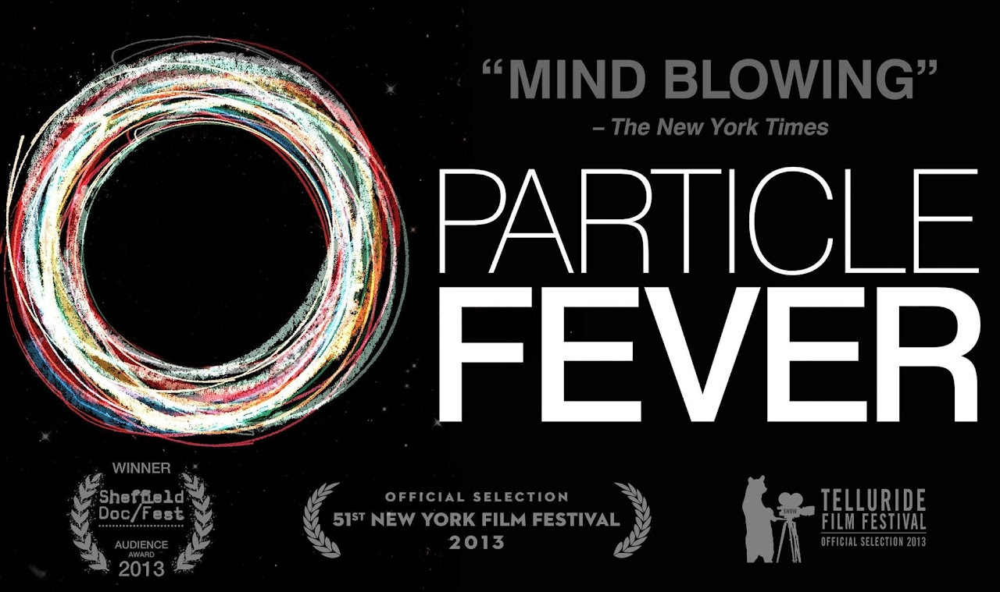

:::::::::::::::::::::::::::::::::::::: questions 

- What is the LHC?
- What is CERN?
- What is the CMS experiment?
- What are we trying to do at these experiments?

::::::::::::::::::::::::::::::::::::::::::::::::

::::::::::::::::::::::::::::::::::::: objectives

- Understand what takes place at CERN
- Understand what the Large Hadron Collider is
- Understand some of the specifics about the CMS detector

::::::::::::::::::::::::::::::::::::::::::::::::

# Videos

## The CMS experiment

A nice overview of the CMS experiment from the [CMS experiment's YouTube channel](https://www.youtube.com/@CMSExperiment).
If you only watch one of these videos, this is the one!

](fig/intro_cms_YT.jpeg){alt="Photograph of the CMS experiment." width=800px}

## The LHC

A oldie, but a goodie. A discussion of the Large Hadron Collider, by Don Lincoln of Fermilab. You can find more of his videos
over on [Fermilab's YouTube channel](https://www.youtube.com/@fermilab).

](fig/don_lincoln_lhc.jpeg){alt="Photograph of Don Lincoln and the words LHC: the Large Hadron Collider." width=800px}

## What are we doing and what comes next?

A discussion of what CERN and the LHC experiments have accomplished and what comes next? 
From Cleo Abram's [YouTube science popularizing channel "Huge if true"](https://www.youtube.com/@CleoAbram).

](fig/cleo_abram_CERN.jpeg){alt="Photograph of Cleo Abram and the words Did We Do It" width=800px}

## Watch a movie!

If you have time, grab some family and friends and watch [Particle Fever](https://www.imdb.com/title/tt1385956/), the 2013 documentary 
about the discovery of the Higgs Boson.

There are different streaming services that provide access to the movie and we leave it to you find one that works
for your situation and your country's viewing options.

From [Wikipedia](https://en.wikipedia.org/wiki/Particle_Fever):

*Particle Fever is a 2013 American documentary film tracking the first round of experiments at the Large Hadron Collider (LHC) near Geneva, Switzerland. The film follows the experimental physicists at the European Organization for Nuclear Research (CERN) who run the experiments, as well as the theoretical physicists who attempt to provide a conceptual framework for the LHC's results. The film begins in 2008 with the first firing of the LHC and concludes in 2012 with the successful identification of the Higgs boson.*

{alt="Advertisement for the documentary movie Particle Fever" width=800px}

::::::::::::::::::::::::::::::::::::: keypoints 

- CERN is a multinational particle physics lab in Geneva, Switzerland
- The LHC is a 27-km proton accelerator that is used by multiple experiments to study the building blocks of matter
- CMS is one of these experiments and had a role in the discovery of the Higgs boson
- There is more new physics waiting to be discovered!

::::::::::::::::::::::::::::::::::::::::::::::::

[r-markdown]: https://rmarkdown.rstudio.com/
